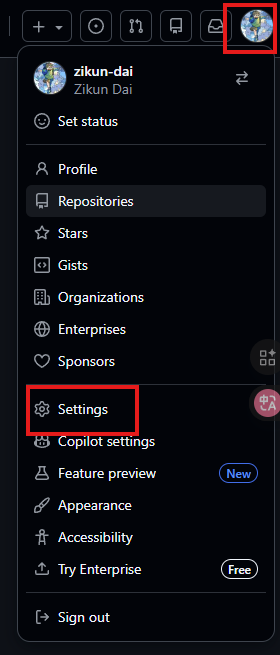
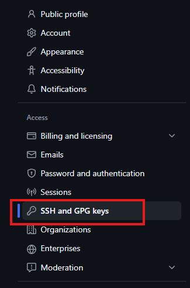
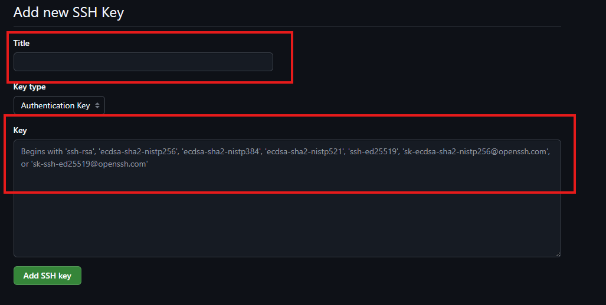

## 目前有点问题，不要照这个文件操作

1. **生成ssh秘钥**

	```bash
	ssh-keygen -t rsa -b 4096 -C "yuexin_guo@smail.nju.edu.cn"
	```

	```bash
	cat ~/.ssh/id_rsa.pub
	```

	把整段内容复制

2. **在github中添加ssh秘钥，步骤如下：**

  

  

  

  

  最后一张图，title自定义一下，Key填写刚刚复制的整段内容

  添加完成后，把`All_Devices`下边的那行代码复制（格式为"SHA256:一串代码"，整行复制，包括SHA256）

3. **回到终端，执行以下代码**

	```bash
	git config --global user.signingkey 末尾粘贴刚刚复制的那一整行代码
    git remote set-url origin git@github.com:yuexin-UvU/yuexin-uvu.github.io.git
    ssh -T git@github.com
	```

	
	
4. **GPG秘钥**

  ```bash
  gpg --full-generate-key
  ```

  前面一直回车即可，姓名、邮箱填写一下，最后设置一个密码

  ```bash
  gpg --list-secret-keys --keyid-format LONG
  ```

  你将看到类似以下的输出：

  ```bash
  /home/username/.gnupg/secring.gpg
  ------------------------------
  sec   4096R/<key_id> 2019-03-06 [expires: 2020-03-06]
  uid                          Your Name <your-email@example.com>
  ssb   4096R/<subkey_id> 2019-03-06
  ```

  用 `<key_id>` 替换实际的密钥 ID，并运行以下命令导出公钥：

  ```bash
  gpg --armor --export <key_id>
  ```

  然后将导出的公钥复制到 GitHub 中：

  1. 打开 GitHub。
  2. 进入 **Settings** > **SSH and GPG keys**。
  3. 点击 **New GPG key**，将你复制的公钥粘贴进去并保存。

  

  回到终端，执行：

  ```bash
  git config --global user.signingkey <key_id>
  git config --global commit.gpgSign true
  
  git config --get commit.gpgSign
  ```

  

  